# 67 Duels

<p align="center">
  
</p>

<p align="center">
  <strong>Two players. One camera. Thirty seconds of extremely serious 67 competition.</strong>
</p>

67 Duels is a local browser arcade game built for a college freshie event. Two players stand side-by-side in one webcam feed while MediaPipe tracks their hands. Each clear high/low hand swap counts as a rep, and the player with the highest score after 30 seconds wins.

The app includes a meme-filled landing page, player name entry, the live duel arena, match history, a local leaderboard, and JSON record backups. It has no backend and sends no camera footage to a server.

## Features

- Two-player split-camera arena with red and blue player lanes
- MediaPipe Hand Landmarker tracking up to four hands in real time
- Party-forgiving swap detection with vertical thresholds and debounce protection
- 3-second countdown and fixed 30-second rounds
- Player names, rematches, winner results, and new-player flow
- Independent leaderboard entries for every player appearance
- Match history with scores, winners, and timestamps
- Browser-local persistence for up to 500 completed matches
- JSON export, validated import, and protected record clearing
- GPU-first MediaPipe initialization with CPU fallback
- Responsive landing page and dialogs for desktop and mobile
- Debug overlay for landmarks, lane status, and swap state

## Quick Start

### Requirements

- Node.js 18 or newer
- npm
- Chrome or Edge
- A webcam with enough room for two players

### Run locally

```bash
git clone https://github.com/itsMarchus/67-Duels.git
cd 67-Duels
npm install
npm run dev
```

Open [http://127.0.0.1:5173](http://127.0.0.1:5173), allow camera access when prompted, and choose **Play Now**.

If port `5173` is busy, Vite will print the alternate local URL in the terminal.

## How To Play

1. Select **Play Now** on the landing page.
2. Enter a name for Player 1 and Player 2.
3. Allow webcam access and select **Camera** in the arena.
4. Stand on opposite sides of the center divider.
5. Each player must keep two hands visible in their lane.
6. Select **Start** and alternate one hand high while the other is low.
7. Complete as many clear swaps as possible before the 30-second timer ends.

After the result, players can rematch with the same names, choose new players, or return home. Every completed round is saved as a separate record.

## Computer Vision Pipeline

```mermaid
flowchart LR
    A[Webcam] --> B[MediaPipe Hand Landmarker]
    B --> C[Mirror display coordinates]
    C --> D[Assign hands to left or right lane]
    D --> E[Require two visible hands]
    E --> F[Classify high and low swap state]
    F --> G[Apply threshold and debounce]
    G --> H[Count rep and update score]
    H --> I[Save completed match locally]
```



The hand tracker runs in `VIDEO` mode with `numHands: 4`. Detected landmarks are mirrored to match the selfie-camera display, then assigned to a player according to their horizontal center. Scoring pauses whenever a player has fewer than two valid hands in their zone.

A rep is recorded when the two hands alternate between these states:

- Left hand high, right hand low
- Right hand high, left hand low

The fast-gesture settings use a normalized vertical threshold of `0.040`, an `80 ms` debounce, a `180 ms` missing-hand grace period, and MediaPipe detection/presence/tracking thresholds of `0.35 / 0.35 / 0.30`. These values live in `src/cv/types.ts`.

### Fast-Gesture Diagnostics

The tracker processes each decoded camera frame once and limits React tracking rerenders to 20 Hz so scoring has priority. Select the bug button in the arena to show:

- Processed CV FPS and actual camera FPS
- Rolling average inference latency
- Current detected-hand count and repeated frames skipped
- Accepted reps, debounce rejections, and brief-dropout grace events for each player

Brief hand loss preserves the last stable gesture for up to `180 ms`, but scoring remains observed-only: missing frames never create estimated extra reps.

## Arcade Records

The **Arcade Records** dialog has two views:

- **Leaderboard:** every player appearance ranked by its individual round score
- **Match History:** every completed matchup, final score, winner, and time played

Equal scores share the same rank, with newer performances displayed first. Reusing a name does not merge players; each appearance remains an independent entry.

Records are stored in the current browser profile under the versioned key `67-duels.arcade.v1`. Active player names use `sessionStorage`, while completed matches use `localStorage`.

Use **Export** before moving computers or clearing browser data. **Import** validates a 67 Duels JSON backup before replacing the current records.

## Privacy

- Camera frames are processed locally in the browser.
- The app has no accounts, analytics, API calls, or leaderboard server.
- Video and hand landmarks are not uploaded or saved.
- Only entered names, scores, winners, and match timestamps are persisted.

## Project Structure

```text
src/
  arcade/       Player session and local record storage
  components/   Player setup and records dialogs
  cv/           MediaPipe loading, zones, tracking, and rep detection
  game/         Round state and timer logic
  pages/        Landing page and duel arena
public/
  memes/        Local landing-page meme assets
  models/       MediaPipe hand landmarker model
  wasm/         Local MediaPipe vision runtime
```

## Commands

```bash
npm run dev       # Start the local development server
npm run build     # Type-check and create a production build
npm run preview   # Preview the production build locally
npm test          # Run Vitest in watch mode
npm run test:run  # Run the complete test suite once
```

The tests cover lane assignment, hand tracking state, swap classification, debounce behavior, round timing, player names, match persistence, record pruning, leaderboard ties, and winner labels.

## Custom Meme Assets

Landing-page images live in `public/memes/`. The duel arena can also load optional meme images listed in `public/memes/manifest.json`; when the manifest is empty, the arena uses generated text stickers.

## Deployment Notes

The project builds as a static Vite app. A deployed version must use HTTPS for browser camera access and should redirect unknown routes such as `/play` to `index.html` so React Router can handle them.

For an event booth, keep the browser open on one computer profile so local rankings remain available throughout the session. Export the records JSON periodically as a backup.

## Built With

- React 18
- TypeScript
- Vite
- MediaPipe Tasks Vision
- React Router
- Lucide React
- Vitest

MediaPipe reference: [Hand Landmarker for Web](https://developers.google.com/mediapipe/solutions/vision/hand_landmarker/web_js)
