# 67 Duels

<p align="center">
  
</p>

<p align="center">
  <strong>Solo leaderboard chase or side-by-side duel. One camera. Thirty seconds of extremely serious 67 competition.</strong>
</p>

67 Duels is a browser arcade game for quick Solo leaderboard runs and side-by-side competition. MediaPipe tracks each player's hands locally and counts every clear high/low swap as a rep.

- **Solo:** one player, two hands, and a public Redis-backed Top 100.
- **Duel:** two players, four hands, split camera lanes, and browser-local match records.

Camera frames and hand landmarks never leave the device. Solo sends only the entered name, final score, and server timestamp to the leaderboard.

## Features

- Solo and two-player Duel modes with no account or login
- Global Solo Top 100 powered by Upstash Redis and Vercel Functions
- Browser-local Duel leaderboard, match history, and JSON backups
- MediaPipe Hand Landmarker tracking up to four hands in real time
- Party-forgiving swap detection with an 80 ms debounce and brief-dropout grace
- Signed one-use Solo round tokens and server-side score validation
- Worker-based GPU-first inference with CPU and main-thread fallbacks
- Adaptive `960x540` to `640x360` camera performance profiles
- Responsive desktop and mobile arena with safe-area support
- Debug overlay for landmarks, runtime mode, inference latency, and measured FPS

## Quick Start

### Requirements

- Node.js 18 or newer
- npm
- Chrome, Edge, or another current browser
- A webcam
- Vercel CLI and Redis environment variables for the complete Solo API flow

### Frontend development

```bash
git clone https://github.com/itsMarchus/67-Duels.git
cd 67-Duels
npm install
npx vercel@56.4.1 pull --yes --environment development
npm run dev
```

Open the URL printed by Vercel, normally `http://localhost:3000`. The default command loads `.env.local` and starts Vite together with the Vercel Functions, so both Solo and Duel work. Use `npm run dev:frontend` only when intentionally testing the frontend without Solo API routes on port `5173`.

## How To Play

1. Select **Play Now**.
2. Choose **Solo** or **Duel** and enter the player names.
3. Allow camera access; the camera and hand model start automatically.
4. Select **Start** and alternate one hand high while the other is low.
5. Complete as many clear swaps as possible in 30 seconds.

Solo tracks two hands anywhere in the camera and submits the final result to the global board. Duel assigns hands to the red and blue lanes and stores completed matches in the current browser.

## Computer Vision Pipeline

```mermaid
flowchart LR
    A[Webcam] --> B[Fresh-frame scheduler]
    B --> C[MediaPipe worker]
    C --> D[Mirror display coordinates]
    D --> E[Select Solo hands or Duel zones]
    E --> F[Require two visible hands]
    F --> G[Classify high and low swap state]
    G --> H[Apply threshold and debounce]
    H --> I[Count rep and update score]
    I --> J[Save local Duel or submit Solo result]
```



The tracker uses MediaPipe Hand Landmarker in `VIDEO` mode with `numHands: 4`. Supported browsers run GPU-first inference in a module worker. The worker falls back to CPU, and browsers without worker frame transfer use the compatible main-thread path.

Camera capture begins at `960x540`. Before a round, measured source FPS, processed FPS, and inference latency can trigger a one-way downgrade to `640x360`. The visible arena stays full-screen while the smaller texture reduces processing work.

The fast-gesture settings use a normalized vertical threshold of `0.040`, an `80 ms` debounce, a `180 ms` missing-hand grace period, and detection/presence/tracking thresholds of `0.35 / 0.35 / 0.30`.

## Arcade Records

The **Arcade Records** dialog has three views:

- **Solo Top 100:** public performances loaded from Redis
- **Duel Scores:** every local player appearance ranked independently
- **Duel History:** local matchups, final scores, winners, and timestamps

Equal scores share a displayed rank, with newer performances first. Repeated names remain independent because there are no accounts.

Duel data is stored under `67-duels.arcade.v1` in `localStorage`. Active game names and modes use `sessionStorage`. Export, import, and clear controls affect only local Duel records.

## Redis And Environment Setup

The project uses Upstash Redis through the Vercel Marketplace. The score write uses one atomic Lua script, leaderboard reads are cached for 15 seconds, and Redis retains only the 100 scores currently on the public board. After every accepted submission, entries below the Top 100 cutoff are deleted; there is no separate Solo history list.

One Redis database can safely serve several projects. The database name, such as **Personal**, does not control isolation; each project must use a different key prefix. 67 Duels defaults to the `67-duels` namespace, producing keys such as `67-duels:solo:leaderboard:v1`. A different project could use `portfolio-app` without colliding.

1. Open the Vercel project.
2. Select **Storage** or **Marketplace**, install **Upstash Redis**, and connect it to this project.
3. Confirm Vercel created `UPSTASH_REDIS_REST_URL` and `UPSTASH_REDIS_REST_TOKEN`.
4. Optionally set `REDIS_KEY_PREFIX=67-duels`. It can be omitted because `67-duels` is the safe default; use a different prefix in every other project.
5. Generate a private signing secret:

   ```bash
   node -e "console.log(require('crypto').randomBytes(32).toString('base64url'))"
   ```

6. Add the output as `SOLO_SCORE_SECRET` for Development, Preview, and Production.
7. Redeploy after adding the variables.

For local full-stack development, create `.env.local` from `.env.example` or pull the Vercel variables:

```bash
npx vercel env pull .env.local
npm run dev
```

The credentials and signing secret deliberately have no `VITE_` prefix, so Vite cannot place them in the browser bundle. `REDIS_KEY_PREFIX` is also server-only. `.env`, `.env.*`, and `.vercel/` are ignored by Git; only `.env.example`, with blank credential placeholders and the safe default prefix, is committed.

Never paste real Redis credentials into source files, client code, GitHub issues, screenshots, or variables beginning with `VITE_`.

## Solo Submission Protection

Solo mode has no login, so a determined person can still forge browser-side gameplay. The API adds practical abuse protection without uploading video:

- A signed token is issued before each Solo countdown.
- Submissions are accepted only after a 30-second round and expire after five minutes.
- Each token can be submitted once.
- A short-lived hashed connection identifier limits submission bursts without storing the player's IP address.
- Scores must be integers between 0 and 400.
- Names are trimmed, length-limited, and checked server-side.
- Redis credentials and the signing secret exist only inside Vercel Functions.

The Top 100 is meant for friendly arcade competition, not prize-bearing or security-critical scoring.

## Privacy

- Camera frames and landmarks are processed locally.
- Video, images, and landmarks are never uploaded or stored.
- Duel records remain in the browser.
- Solo submits only the player name, final score, and timestamp.
- The app has no accounts and does not require email or other identity data.

## Project Structure

```text
api/            Vercel Function endpoints for Solo rounds and scores
server/         Token validation and Redis leaderboard helpers
src/
  arcade/       Active sessions, client API, and local Duel records
  components/   Player setup and records dialogs
  cv/           MediaPipe loading, zones, tracking, and rep detection
  game/         Round state and timer logic
  pages/        Landing page and camera arena
public/
  memes/        Local landing-page meme assets
  models/       MediaPipe hand landmarker model
  wasm/         Local MediaPipe vision runtime
```

## Commands

```bash
npm run dev           # Start Vite plus Vercel Functions, normally on port 3000
npm run dev:frontend  # Start frontend-only Vite without Solo APIs
npm run build         # Type-check client/API code and build production assets
npm run preview   # Preview static production assets
npm test          # Run Vitest in watch mode
npm run test:run  # Run all tests once
npm run check     # Run tests and the production build release gate
```

## Production Deployment

The camera and computer vision remain client-side, while three lightweight Vercel Functions handle Solo tokens, score submission, and leaderboard reads.

Before deployment:

```bash
npm ci
npm run check
```

Then confirm the Upstash integration and `SOLO_SCORE_SECRET` exist in the Vercel project's Production environment. Deploy from the intended Git branch and test both modes over HTTPS.

Deployment support included here:

- `vercel.json` provides SPA rewrites, camera permissions, and security headers.
- `api/*.ts` contains the Vercel Functions.
- `public/_redirects` and `public/_headers` support static-only hosts, where Duel works but the Solo API does not.
- Public assets and React Router honor Vite's base path.

Before sharing a deployment, test its URL on a laptop and at least one phone. Complete a Solo run, confirm its global rank appears, complete a Duel, reload, and confirm the local record remains.

## Built With

- React 18
- TypeScript
- Vite
- MediaPipe Tasks Vision
- Vercel Functions
- Upstash Redis
- React Router
- Lucide React
- Vitest

References: [MediaPipe Hand Landmarker](https://developers.google.com/mediapipe/solutions/vision/hand_landmarker/web_js), [Upstash Redis TypeScript SDK](https://upstash.com/docs/redis/sdks/ts/getstarted), [Vercel Redis integrations](https://vercel.com/docs/redis)
